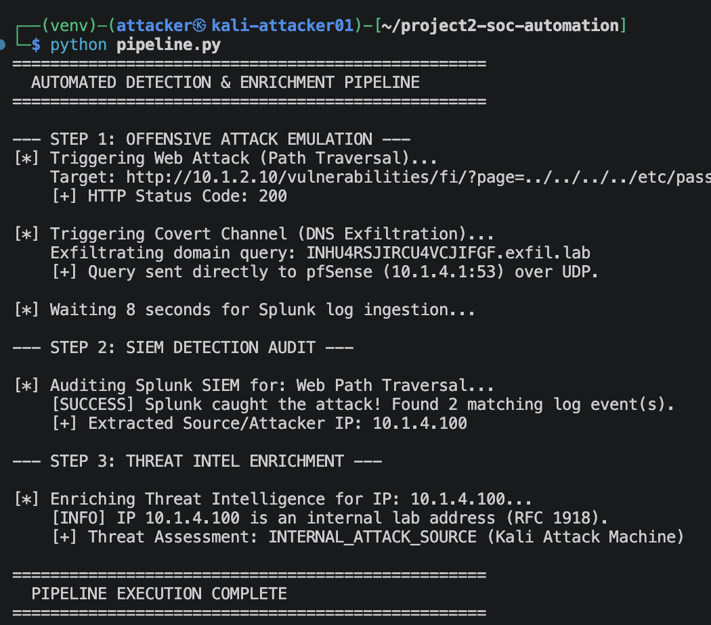
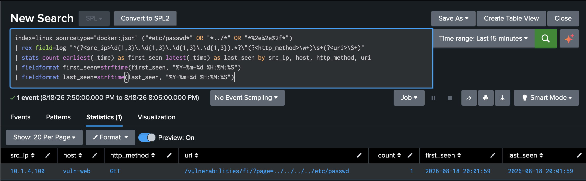

# Project 2: Automated Adversary Emulation & SIEM Detections

An automated SOC pipeline built on Kali Linux that simulates web and DNS attacks, audits Splunk SIEM detections over the REST API, enriches threat intelligence with AbuseIPDB, and uses custom SPL correlation rules.

---

📄 **Complete Technical Report:** Download the full [Project 2 Writeup (PDF)](assets/project-2-writeup.pdf) for complete step-by-step implementation logs, extended troubleshooting notes, and screenshots.

---

## 🛠️ Quick Start & Usage

1. **Clone the repository:**
```
git clone https://github.com/antonvikstrom/automated-threat-detection-pipeline.git
cd project2-soc-automation
```

2. **Configure your environment:**
```
cp .env.example .env
# Add your Splunk IP, API token, and AbuseIPDB key to .env
```


3. **Run the master pipeline:**
```
python pipeline.py

```
---

## 📂 Repository Layout

* `pipeline.py`: Master script running attack emulation, SIEM auditing, and threat intel enrichment.
* `attack_module.py`: Simulates web path traversal and covert DNS exfiltration.
* `splunk_module.py`: Audits Splunk over the REST API (port 8089) to verify log ingestion.
* `threat_intel.py`: Checks if attacker IPs are internal or queries AbuseIPDB for external reputation.
* `queries/`: Custom SPL correlation rules for Splunk.

---

## Module 1: Environment Setup & API Connection

### Workspace & API Setup

To get started on Project 2, I created a Python project directory on my Kali Linux attack machine (`10.1.4.100`) and connected to it from VS Code on my laptop using the Remote-SSH extension. This gave me a full code editor on my desktop while executing everything directly inside Kali.

I set up a Python virtual environment to keep packages isolated and generated a dedicated REST API token inside Splunk Web. To keep credentials safe, I stored the token and host IP addresses inside a `.env` file rather than hardcoding them into my source code.

### Troubleshooting Network Isolation (Port 9997 vs 8089)

When I ran my initial test script (`test_splunk_conn.py`) to query Splunk at `10.1.1.10:8089`, the request timed out.

I realized this was due to the pfSense boundary rules I created in Project 1. While log telemetry streams into Splunk over port 9997, Splunk uses port 8089 for REST API management and searches. Because the Attack Zone is isolated from internal networks, pfSense dropped the API traffic before it could reach the SIEM.

### Fixing the Firewall Rule & Verifying Success

I created a new pfSense rule intended to allow traffic from my Kali machine's subnet over port 8089. However, when I tested the connection with `netcat`, it was still timing out.

After some troubleshooting, I found out that the new pass rule I created for port 8089 had its source set to `OPT3 address` (which only matches the pfSense gateway interface IP) instead of `OPT3 subnets` (which covers my Kali machine). Because Kali's IP didn't match, the traffic fell through to my default rule blocking all private subnets.

I edited the rule source to `OPT3 subnets`, saved, and applied the changes. Re-testing with `netcat` immediately showed an open port, and running `python test_splunk_conn.py` returned a clean `[SUCCESS]` response.



---

## Module 2: Automated Attack Simulation & SIEM Detection Audit

### Building the Attack Script (`attack_module.py`)

Next, I created `attack_module.py` to simulate two different attack techniques from my Kali machine (`10.1.4.100`):

1. **Web Path Traversal:** Sends an HTTP GET request to DVWA on `vuln-web` (`10.1.2.10`) targeting `/vulnerabilities/fi/?page=../../../../etc/passwd`. This simulates a Local File Inclusion (LFI) attack trying to read local system files.


2. **Covert DNS Exfiltration:** Encodes a sensitive text string into Base32 and embeds it inside a DNS subdomain query (like `INHU4RSJIRCU4VCJIFGF.exfil.lab`). To ensure the request always goes directly to pfSense (`10.1.4.1`) regardless of Kali's system DNS configuration, I had the script send a raw UDP DNS packet directly to port 53.


### Automating SIEM Verification (`splunk_module.py`)

Instead of opening Splunk Web and manually checking for logs after every test, I wrote `splunk_module.py` to audit detections automatically over the REST API.

The script uses the API token in my `.env` file to connect to `https://10.1.1.10:8089` and runs fast oneshot searches for events from the last 5 minutes:

* `index=* "etc/passwd"` to find the web path traversal logs.


* `index=* "exfil.lab"` to find pfSense DNS query logs.


When Splunk finds a match, the script prints `[SUCCESS]`, counts the matching events, and extracts the attacker's source IP (`10.1.4.100`) so we can pass it down the pipeline.

### Troubleshooting Missing DNS Logs in pfSense

When I tested the pipeline, the web path traversal attack worked right away—it returned an HTTP 200 response and Splunk caught the log. However, the DNS exfiltration check kept returning `[FAILURE]`.

Checking pfSense's log viewer revealed that the DNS resolver hadn't recorded any new logs in weeks. To get DNS query telemetry flowing from pfSense into Splunk, I adjusted three settings:

1. **Enabled Query Logging:** Added `log-queries: yes` under **Services > DNS Resolver > General Settings (Custom Options)** and set the log level to Level 2 under Advanced Settings.


2. **Forwarded DNS Syslog:** Opened **Status > System Logs > Settings** and checked the box for DNS Events under Remote Logging Options so pfSense forwarded DNS logs to Splunk over UDP port 1514.


3. **Checked Listening Interfaces:** Confirmed the DNS Resolver was set to listen on all interfaces, including OPT3 (the Attack Zone subnet).


After restarting the DNS Resolver service and re-running the scripts, Splunk caught both attacks immediately, returning matching log counts and successfully extracting my Kali IP.

### Threat Intelligence & Master Pipeline (`pipeline.py`)

To finish the pipeline, I wrote `threat_intel.py` to enrich the extracted IP address, then created `pipeline.py` to run all three steps automatically in a single command:

* **Internal IPs:** If the IP is a private address (like my Kali machine at `10.1.4.100`), the script marks it as an internal lab host instead of making unnecessary external API calls.


* **Public IPs:** If it's an external address, the script queries AbuseIPDB to pull reputation scores, country data, and usage types.


Running `python pipeline.py` executes the whole flow end-to-end: it fires the web and DNS attacks, pauses briefly for Splunk to ingest the logs, checks the SIEM over the API, and enriches the attacker IP in less than 15 seconds.

---

## Module 3: Writing & Tuning Splunk Detections (SPL Rules)

### Building the LFI & Path Traversal Rule

To finish up Project 2, I wrote custom Splunk searches (SPL rules) to automatically catch web attacks and covert DNS exfiltration.

When I ran my first search for path traversal (`index=linux uri="*etc/passwd*"`), Splunk showed 0 events, even though my Python attack script got an HTTP 200 success response from DVWA.

**Troubleshooting Container Logs:**
I ran a broader search (`index=linux "passwd"`) to look at the raw log data:

* I noticed DVWA runs inside a Docker container, so Splunk ingests its logs under `sourcetype="docker:json"`.


* The web request was nested inside a JSON field named `log`. Because Splunk hadn't automatically parsed fields like `uri` or `src_ip`, standard field searches didn't work.


To fix this, I added inline regular expressions (`rex`) to pull the attacker IP, HTTP method, and requested URI straight out of the raw container log on the fly.

```spl
index=linux sourcetype="docker:json" ("*etc/passwd*" OR "*../*" OR "*%2e%2e%2f*")
| rex field=log "^(?<src_ip>\d{1,3}\.\d{1,3}\.\d{1,3}\.\d{1,3}).*?\"(?<http_method>\w+)\s+(?<uri>\S+)"
| stats count earliest(_time) as first_seen latest(_time) as last_seen by src_ip, host, http_method, uri
| fieldformat first_seen=strftime(first_seen, "%Y-%m-%d %H:%M:%S")
| fieldformat last_seen=strftime(last_seen, "%Y-%m-%d %H:%M:%S")

```

* **MITRE ATT&CK Mapping:** T1190 (Exploit Public-Facing Application) & T1083 (File and Directory Discovery)



### Building the DNS Exfiltration Rule

Next, I created a search to flag encoded DNS queries targeting my lab domain (`.exfil.lab`).

My initial search (`index=pfsense sourcetype="pfsense:unbound"`) also returned 0 events.

**Troubleshooting pfSense Telemetry:**
I searched across all indexes (`index=* "exfil.lab"`) to see how old logs were formatted:

* I realized pfSense sends Unbound DNS logs to Splunk under `sourcetype=syslog` (not `pfsense:unbound`).


* Telemetry had stopped arriving because the pfSense `syslogd` and `unbound` services had stalled.


I logged into the pfSense WebGUI, went to **Status > Services**, and restarted both `syslogd` and `unbound`. After re-running my attack script from Kali, new logs immediately showed up in Splunk.

```spl
index=* sourcetype=syslog "exfil.lab"
| rex field=_raw "info:\s+(?<client_ip>\d{1,3}\.\d{1,3}\.\d{1,3}\.\d{1,3})\s+(?<query_domain>[A-Za-z0-9\=\.]+\.exfil\.lab)"
| stats count, values(client_ip) as attacker_ip by query_domain

```

* **MITRE ATT&CK Mapping:** T1071.004 (Application Layer Protocol: DNS) & T1048.003 (Exfiltration Over Alternative Protocol)


---

## Project 2 Wrap-Up & Key Takeaways

To keep my detection rules saved and version-controlled, I created a `queries/` folder in my GitHub repository and added both files:

* `queries/lfi_detection.spl`

* `queries/dns_exfiltration.spl`


### Key Takeaways & Lessons Learned

* **Log Ingestion & Parsing:** Learned that containerized applications (like Dockerized DVWA) nest logs inside JSON wrapper fields (`sourcetype="docker:json"`), requiring inline regex (`rex`) to extract field values like `src_ip` and `uri`.


* **Network & Gateway Troubleshooting:** Identified how pfSense handles DNS telemetry under `sourcetype=syslog` rather than standard unbound sourcetypes, and solved ingestion freezes by restarting gateway services (`syslogd` / `unbound`).


* **Closed-Loop SOC Automation:** Built a complete, end-to-end Python pipeline (`pipeline.py`) that executes an attack, audits the SIEM via API, and enriches attacker IPs in under 15 seconds.
